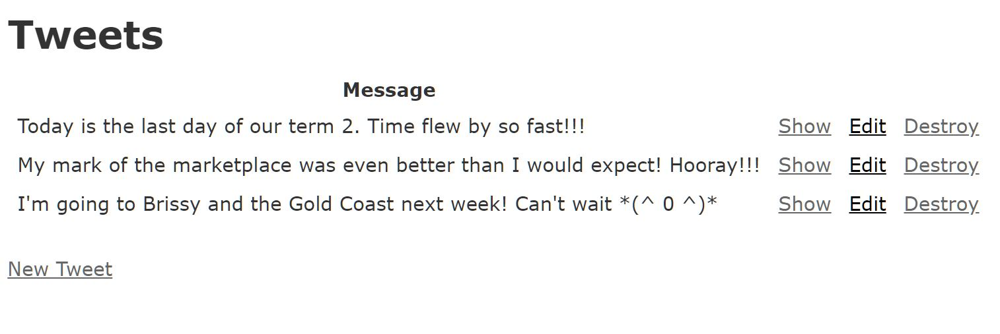

# [Challenge] 1121 AJAX, CORS, Promises & Fetch API - AJAX
Instructions: https://coderacademyedu.github.io/resources/unit_ajax.html

---

__Challenge 1.	Create a new 'Tweeter' rails app. Scaffold 'Tweet' with a single field: 'message'__
```
$ rails new Tweeeter -d postgresql
$ cd Tweeeter
$ sudo service postgresql start 
$ rails db:create
$ rails db:migrate 
$ rails g scaffold Tweet message:string 
$ rails db:migrate
```
---
__Challenge 2.	Start your Rails server and add a few tweets.__
```
$ rails s
```



---

__Challenge 3.	Create a new HTML document, add jQuery.__
- Directory: https://github.com/EllieChen-Git/in-class-javascript-challenges/tree/master/AJAX
- Touch index.html
- Copy the 'jquery.min.js' file into the same folder as 'index.html'.
- Add script tag inside the head of index.html
```html
        <script src="jquery.min.js" type="text/javascript"></script>
```
---
__Challenge 4.	Use jQuery to send a request to your Rails server, GET all the tweets. You'll need to resolve the CORS issue, Google :).__

- Add .json to your URL to turn your Rails app endpoint (http://localhost:3000/tweets) into an API (http://localhost:3000/tweets.json)

- Go to config\application.rb in your Rails app, and add the following code inside 'class Application < Rails::Application':
```ruby
    config.action_dispatch.default_headers = {
      'Access-Control-Allow-Origin' => '*'
    }
```
- Remember to restart your Rails server

a) Using XHR requests to console.log all the tweets

```html
        <button id="myBtn">Get Tweets</button>

        <script>
            document.querySelector("#myBtn").addEventListener("click", getTweets);

            function getTweets(){
                // console.log("working");  //First write simple code to test if everything's working

                let request = new XMLHttpRequest();

                request.open("GET", "http://localhost:3000/tweets.json", true); // True: asynchronous

                request.onerror = () => {
                    console.log("Connection error!");
                }

                request.onload = () => {
                    if (request.status >= 200 && request.status < 300){
                        let parsedResponse = JSON.parse(request.responseText);
                        for(let i = 0; i < parsedResponse.length; i++){
                            console.log(parsedResponse[i].message);
                        }
                    } else {
                        console.log("Error", request);
                    }
                }
                
                request.send();
            }
        </script>
```
---
__Challenge 5.	Display all of these tweets on your page. Add some styling or use a framework to make it look more Twitter-esque__

b) Using jQuery AJAX to display all the tweets

```html
to do
```

c) Using Fetch to display all the tweets

```html
to do
```
---
__Challenge 6.	Replace your jQuery AJAX with Fetch.__

---
